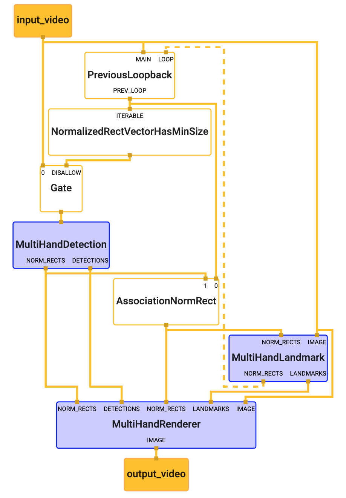

## Multi-Hand Tracking on Desktop

This is an example of using MediaPipe to run hand tracking models (TensorFlow
Lite) and render bounding boxes on the detected hand instances (for multiple
hands). To know more about the hand tracking models, please refer to the model
[`README file`]. Moreover, if you are interested in running the same TensorfFlow
Lite model on Android/iOS, please see the
[Mulit-Hand Tracking on GPU on Android/iOS](multi_hand_tracking_mobile_gpu.md)
and

We show the hand tracking demos with TensorFlow Lite model using the Webcam:

-   [TensorFlow Lite Multi-Hand Tracking Demo with Webcam (CPU)](#tensorflow-lite-multi-hand-tracking-demo-with-webcam-cpu)

-   [TensorFlow Lite Multi-Hand Tracking Demo with Webcam (GPU)](#tensorflow-lite-multi-hand-tracking-demo-with-webcam-gpu)

Note: Desktop GPU works only on Linux. Mesa drivers need to be installed. Please
see
[step 4 of "Installing on Debian and Ubuntu" in the installation guide](./install.md).

Note: If MediaPipe depends on OpenCV 2, please see the
[known issues with OpenCV 2](./object_detection_desktop.md#known-issues-with-opencv-2)
section.

### TensorFlow Lite Multi-Hand Tracking Demo with Webcam (CPU)

To build and run the TensorFlow Lite example on desktop (CPU) with Webcam, run:

```bash
# Video from webcam running on desktop CPU
$ bazel build -c opt --define MEDIAPIPE_DISABLE_GPU=1 \
    mediapipe/examples/desktop/multi_hand_tracking:multi_hand_tracking_cpu

# It should print:
#Target //mediapipe/examples/desktop/multi_hand_tracking:multi_hand_tracking_cpu up-to-date:
#  bazel-bin/mediapipe/examples/desktop/multi_hand_tracking/multi_hand_tracking_cpu

# This will open up your webcam as long as it is connected and on
# Any errors is likely due to your webcam being not accessible
$ GLOG_logtostderr=1 bazel-bin/mediapipe/examples/desktop/multi_hand_tracking/multi_hand_tracking_cpu \
    --calculator_graph_config_file=mediapipe/graphs/hand_tracking/multi_hand_tracking_desktop_live.pbtxt
```

### TensorFlow Lite Multi-Hand Tracking Demo with Webcam (GPU)

To build and run the TensorFlow Lite example on desktop (GPU) with Webcam, run:

```bash
# Video from webcam running on desktop GPU
# This works only for linux currently
$ bazel build -c opt --copt -DMESA_EGL_NO_X11_HEADERS --copt -DEGL_NO_X11 \
    mediapipe/examples/desktop/multi_hand_tracking:multi_hand_tracking_gpu

# It should print:
# Target //mediapipe/examples/desktop/multi_hand_tracking:multi_hand_tracking_gpu up-to-date:
#  bazel-bin/mediapipe/examples/desktop/multi_hand_tracking/multi_hand_tracking_gpu

# This will open up your webcam as long as it is connected and on
# Any errors is likely due to your webcam being not accessible,
# or GPU drivers not setup properly.
$ GLOG_logtostderr=1 bazel-bin/mediapipe/examples/desktop/multi_hand_tracking/multi_hand_tracking_gpu \
    --calculator_graph_config_file=mediapipe/graphs/hand_tracking/multi_hand_tracking_mobile.pbtxt
```

Issues running? Please first
[check that your GPU is supported](./gpu.md#desktop-gpu-linux)

#### Graph



To visualize the graph as shown above, copy the text specification of the graph
below and paste it into [MediaPipe Visualizer](https://viz.mediapipe.dev).

```bash
# MediaPipe graph that performs multi-hand tracking on desktop with TensorFlow
# Lite on CPU.
# Used in the example in
# mediapipie/examples/desktop/multi_hand_tracking:multi_hand_tracking_cpu.

# Images coming into and out of the graph.
input_stream: "input_video"
output_stream: "output_video"

# Determines if an input vector of NormalizedRect has a size greater than or
# equal to the provided min_size.
node {
  calculator: "NormalizedRectVectorHasMinSizeCalculator"
  input_stream: "ITERABLE:prev_multi_hand_rects_from_landmarks"
  output_stream: "prev_has_enough_hands"
  node_options: {
    [type.googleapis.com/mediapipe.CollectionHasMinSizeCalculatorOptions] {
      # This value can be changed to support tracking arbitrary number of hands.
      # Please also remember to modify max_vec_size in
      # ClipVectorSizeCalculatorOptions in
      # mediapipe/graphs/hand_tracking/subgraphs/multi_hand_detection_gpu.pbtxt
      min_size: 2
    }
  }
}

# Drops the incoming image if the previous frame had at least N hands.
# Otherwise, passes the incoming image through to trigger a new round of hand
# detection in MultiHandDetectionSubgraph.
node {
  calculator: "GateCalculator"
  input_stream: "input_video"
  input_stream: "DISALLOW:prev_has_enough_hands"
  output_stream: "multi_hand_detection_input_video"
  node_options: {
    [type.googleapis.com/mediapipe.GateCalculatorOptions] {
      empty_packets_as_allow: true
    }
  }
}

# Subgraph that detections hands (see multi_hand_detection_cpu.pbtxt).
node {
  calculator: "MultiHandDetectionSubgraph"
  input_stream: "multi_hand_detection_input_video"
  output_stream: "DETECTIONS:multi_palm_detections"
  output_stream: "NORM_RECTS:multi_palm_rects"
}

# Subgraph that localizes hand landmarks for multiple hands (see
# multi_hand_landmark.pbtxt).
node {
  calculator: "MultiHandLandmarkSubgraph"
  input_stream: "IMAGE:input_video"
  input_stream: "NORM_RECTS:multi_hand_rects"
  output_stream: "LANDMARKS:multi_hand_landmarks"
  output_stream: "NORM_RECTS:multi_hand_rects_from_landmarks"
}

# Caches a hand rectangle fed back from MultiHandLandmarkSubgraph, and upon the
# arrival of the next input image sends out the cached rectangle with the
# timestamp replaced by that of the input image, essentially generating a packet
# that carries the previous hand rectangle. Note that upon the arrival of the
# very first input image, an empty packet is sent out to jump start the
# feedback loop.
node {
  calculator: "PreviousLoopbackCalculator"
  input_stream: "MAIN:input_video"
  input_stream: "LOOP:multi_hand_rects_from_landmarks"
  input_stream_info: {
    tag_index: "LOOP"
    back_edge: true
  }
  output_stream: "PREV_LOOP:prev_multi_hand_rects_from_landmarks"
}

# Performs association between NormalizedRect vector elements from previous
# frame and those from the current frame if MultiHandDetectionSubgraph runs.
# This calculator ensures that the output multi_hand_rects vector doesn't
# contain overlapping regions based on the specified min_similarity_threshold.
node {
  calculator: "AssociationNormRectCalculator"
  input_stream: "prev_multi_hand_rects_from_landmarks"
  input_stream: "multi_palm_rects"
  output_stream: "multi_hand_rects"
  node_options: {
    [type.googleapis.com/mediapipe.AssociationCalculatorOptions] {
      min_similarity_threshold: 0.5
    }
  }
}

# Subgraph that renders annotations and overlays them on top of the input
# images (see multi_hand_renderer_cpu.pbtxt).
node {
  calculator: "MultiHandRendererSubgraph"
  input_stream: "IMAGE:input_video"
  input_stream: "DETECTIONS:multi_palm_detections"
  input_stream: "LANDMARKS:multi_hand_landmarks"
  input_stream: "NORM_RECTS:0:multi_palm_rects"
  input_stream: "NORM_RECTS:1:multi_hand_rects"
  output_stream: "IMAGE:output_video"
}
```

[`README file`]:https://github.com/google/mediapipe/tree/master/mediapipe/README.md
